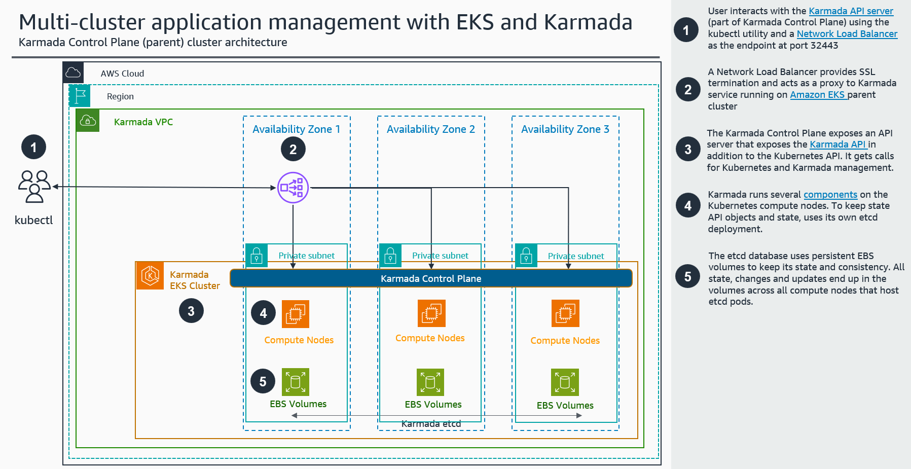

# Guidance for kubernetes multi-cluster management with Amazon Elastic Kubernetes Service (Amazon EKS) and Karmada

## Introduction

This implementation guide describes architectural considerations and configuration steps for deploying a federated Kubernetes environment in Amazon Web Services (AWS) Cloud using [Amazon Elastic Kubernetes Service (Amazon EKS)](https://aws.amazon.com/eks/) and the open source [Kubernetes Armada (Karmada)](https://karmada.io/) project. Karmada is a Kubernetes management system with advanced scheduling capabilities, that enables you to run your cloud-native applications across multiple Kubernetes clusters and clouds, with no changes to your applications.  This guide focuses on deploying Karmada on top of a highly available Amazon EKS cluster.

The intended audience of this guide is infrastructure engineers, architects, system administrators, devops professionals and platform engineers who have practical experience architecting in the AWS Cloud and are familiar with Kubernetes technology.

The purpose of this guide is to provide step-by-step instructions to deploy an Amazon EKS cluster that will host Karmada control plane and act as a parent cluster for multi-cluster management We assume that you already have other [Amazon EKS clusters](https://docs.aws.amazon.com/eks/latest/userguide/create-cluster.html) deployed that will act as member clusters. For the sake of completeness this guide helps you deploy a proof of concept workload distributed among the member clusters.

There are several pre-requisites and for demo purposes we assume the existence of two indepedent, kubernetes clusters to join as members in Karmada. In this guide we assume you have created two [Amazon EKS clusters](https://docs.aws.amazon.com/eks/latest/userguide/create-cluster.html)

By implementing this guidance, you will be able to manage your Kubernetes cluster workloads from a unified management point for all cluster, in other words, a single pane of glass.

## Architecture Overview

The diagram below outlines the architecture of a Karmada cluster that can manage two independent Amazon EKS clusters.



In a similar fashion you can:

- Deploy applications on multiple Amazon EKS clusters that provide a highly available environment
- Create the infrastructure that caters for workloads compliant with local regulation about data residency

## Design considerations

This solution assumes the existence of two Amazon EKS clusters that will be member clusters of the Karmada cluster. However, as Karmada is an extension to the native Kubernetes API you can extend this solution and expand the cluster federation with other kubernetes deployments, not necessarily Amazon EKS.

## Security

When you build systems on AWS infrastructure, security responsibilities are shared between you and AWS. This shared responsibility model reduces your operational burden because AWS operates, manages, and controls the components from the host operating system and virtualization layer down to the physical security of the facilities in which the services operate. For more information about security on AWS, visit [AWS Cloud Security](https://aws.amazon.com/security/).

## Deployment walkthrough

### Prerequisites

For the purspose of this guide you need to have already in place the following prerequisites:

- An active [AWS Account](https://docs.aws.amazon.com/accounts/latest/reference/welcome-first-time-user.html) to deploy the main Amazon EKS cluster.
- Αn [Amazon VPC](https://docs.aws.amazon.com/directoryservice/latest/admin-guide/gsg_create_vpc.html) with:
  - three public [subnets](https://docs.aws.amazon.com/vpc/latest/userguide/create-subnets.html) and enabled the option to auto-assign [public IPv4 address during instance launch](https://docs.aws.amazon.com/AWSEC2/latest/UserGuide/using-instance-addressing.html#public-ip-addresses)
  - three private subnets
- An [Internet Gateway](https://docs.aws.amazon.com/vpc/latest/userguide/VPC_Internet_Gateway.html) with a default route from public subnets
- A [NAT gateway](https://docs.aws.amazon.com/vpc/latest/userguide/vpc-nat-gateway.html) with default route from private subnets to allow Internet access for all cluster nodes.
- A [user with adequate permissions to create, delete Amazon EKS clusters access](https://docs.aws.amazon.com/streams/latest/dev/setting-up.html) and an [Access key/Secret access key](https://docs.aws.amazon.com/IAM/latest/UserGuide/id_credentials_access-keys.html) to configure [AWS Command Line Interface](https://docs.aws.amazon.com/cli/latest/userguide/getting-started-install.html) (AWS CLI).

### Preparation

You can use any linux host that is properly configured to access you AWS environment. The most straight forward way it to use [AWS CloudShell](https://docs.aws.amazon.com/cloudshell/latest/userguide/welcome.html) directly from the [AWS Management Console](https://aws.amazon.com/console/) which requires minimum configuration. However CloudShell is designed for focused, task-based activities. If you want to perform terminal-based tasks using an AWS service with more flexible timeouts, we recommend using our cloud-based IDE, [AWS Cloud9](https://docs.aws.amazon.com/cloud9), or launching and [connecting to an Amazon EC2 instance](https://docs.aws.amazon.com/AWSEC2/latest/UserGuide/AccessingInstances.html).

1. Install and configure the AWS CLI version 2.

```bash
cd /tmp
curl https://awscli.amazonaws.com/awscli-exe-linux-x86_64.zip -o awscliv2.zip
unzip awscliv2.zip
sudo ./aws/install --bin-dir /usr/local/bin --install-dir /usr/local/aws-cli --update
```

1. Install the *eksctl* utility to deploy and manage Amazon EKS clusters in your account.

```bash
cd /tmp
curl -sLO "https://github.com/weaveworks/eksctl/releases/latest/download/eksctl_Linux_amd64.tar.gz"
tar -xzf eksctl_Linux_amd64.tar.gz -C /tmp && rm eksctl_Linux_amd64.tar.gz
chmod +x eksctl
sudo mv /tmp/eksctl /usr/local/bin
```

1. Install the kubectl utility to interact with your Kubernetes clusters

```bash
cd /tmp
curl -O https://s3.us-west-2.amazonaws.com/amazon-eks/1.26.2/2023-03-17/bin/linux/amd64/kubectl
chmod +x ./kubectl
sudo mv kubectl /usr/local/bin
```

1. Install the jq utility to process JSON output from various commands

```bash
sudo yum install jq
```

### Deploy Amazon EKS main cluster for Karmada

After you complete the preliminary steps you proceed with the deployment of an Amazon EKS cluster that will host Karmada.

If necessary, configure the AWS CLI, providing your user's Access Key and Secrete Access Key

```bash
aws configure
AWS Access Key ID [None]: <Access_Key_ID>
AWS Secret Access Key [None]: <Secret_Access_Key>
Default region name [None]: <region_where_VPC_resides>
Default output format [None]: 
```

1. Populate the environment variable KARMADA_VPCID with the VPC id of the VPC that you want to deploy the Karmada cluster (eg. for a VPC with the name tag Karmada_VPC replace <name_of_VPC_you_have_created> with Karmada_VPC).

```bash
KARMADA_VPCID=$(aws ec2 describe-vpcs --filter "Name=tag:Name,Values=*<name_of_VPC_you_have_created>*" --query "Vpcs[].VpcId" --output text)
```

1. Get the list of private subnets for this VPC in environment variable KARMADA_PRIVATESUBNETS. Based on the pre-requisites the criteria for identifying a private subnet is **not** to have the *MapPublicIpOnLaunch* paremeter set to true.

```bash
KARMADA_PRIVATESUBNETS=$(aws ec2 describe-subnets --filters "Name=vpc-id,Values=${KARMADA_VPCID}" --query 'Subnets[?MapPublicIpOnLaunch==`false`].SubnetId' | jq -r '. | @csv')
```

1. Get public subnets for this VPC in environment variable KARMADA_PUBLICSUBNETS. Based on the pre-requisites the criteria for identifying a public subnet is to have the *MapPublicIpOnLaunch* paremeter set to true.

```bash
KARMADA_PUBLICSUBNETS=$(aws ec2 describe-subnets --filters "Name=vpc-id,Values=${KARMADA_VPCID}" --query 'Subnets[?MapPublicIpOnLaunch==`true`].SubnetId' | jq -r '. | @csv')
```

1. Define some environment variables to define the account id, the AWS region to deploy the Amazon EKS main cluster and the preferred cluster name.

**Note:** The KARMADA_REGION variable denoted the region actually used by the CLI regardless of whether environment variables are or are not set_

```bash
KARMADA_ACCOUNTID=$(aws sts get-caller-identity --query "Account" --output text)
KARMADA_REGION=$(aws ec2 describe-availability-zones --output text --query 'AvailabilityZones[0].[RegionName]')
KARMADA_CLUSTERNAME=karmada-parent
KARMADA_HOME=~/.karmada
```

1. Create the karmada home directory. This is within your user's home directory so that you do not need sudo access to run karmada related commands.

```bash
mkdir -p ${KARMADA_HOME}
```

1. Deploy an Amazon EKS cluster with three nodes

**Note:** *This operation will take a few minutes*

```bash
eksctl create cluster --nodes 3 --nodes-min 3 --nodes-max 3 \
--region ${KARMADA_REGION} \
--instance-prefix karmadaeks --auto-kubeconfig --alb-ingress-access --asg-access \
--vpc-private-subnets ${KARMADA_PRIVATESUBNETS} \
--vpc-public-subnets ${KARMADA_PUBLICSUBNETS} \
--name ${KARMADA_CLUSTERNAME}
```

**Note:** In order to allow AWS Management console access to the cluster, if you connect with different than the cli user, then execute the following command replacing where applicable with your actual username (KARMADA_ACCOUNTID is the account ID of your AWS account, as noted above)._

```bash
eksctl create iamidentitymapping \
--cluster ${KARMADA_CLUSTERNAME} \
--arn "arn:aws:iam::${KARMADA_ACCOUNTID}:user/<your_username>" \
--username <your_username> \
--group system:masters --no-duplicate-arns
```

1. Deploy the EBS add-on

   1. In case it does not exist already, associate the IAM OIDC provider

```bash
eksctl utils associate-iam-oidc-provider \
--region=${KARMADA_REGION} \
--cluster=${KARMADA_CLUSTERNAME} \
--approve
```

   1. Create the necessary IAM service account for the EBS CSI controller. In case you have already done it in another region, please adjust the role-name accordingly.

```bash
eksctl create iamserviceaccount \
--cluster ${KARMADA_CLUSTERNAME} \
--region ${KARMADA_REGION} \
--name ebs-csi-controller-sa \
--namespace kube-system  \
--attach-policy-arn arn:aws:iam::aws:policy/service-role/AmazonEBSCSIDriverPolicy \
--approve --role-only \
--role-name AmazonEKS_EBS_CSI_DriverRole
```

  1. Deploy the EBS add-on using the role-name from the previous step

```bash
eksctl create addon \
--cluster ${KARMADA_CLUSTERNAME} \
--region ${KARMADA_REGION} \
--name aws-ebs-csi-driver \
--service-account-role-arn arn:aws:iam::${KARMADA_ACCOUNTID}:role/AmazonEKS_EBS_CSI_DriverRole \
--force
```

  1. Create the configuration for a storage class for the EBS storage.

```bash
cat > ebs-sc.yaml <<EOF
apiVersion: storage.k8s.io/v1
kind: StorageClass
metadata:
  name: ebs-sc
provisioner: ebs.csi.aws.com
volumeBindingMode: WaitForFirstConsumer
parameters:
  type: gp3
EOF
```

  1. Create the storage class

```bash
kubectl apply -f ./ebs-sc.yaml
```

**Important:** In case this commands fails with access denied errors, you may need to remove the *'aws_session_token ='* line from the ~/.aws.credentials file.

1. Verify the operation of the Amazon EKS cluster

Verify cluster resources and status either by using the AWS Management Console or the kubectl utility. Some of the things to check.

```bash
kubectl get svc -A
kubectl get pods -A
kubectl get sc -A
kubectl describe sc ebs-sc
kubectl get nodes -A -o wide
```

For your convenience below is the sample output of the commands above for our testing cluster*

- Get all services

```bash
$ kubectl get svc -A
NAMESPACE     NAME         TYPE        CLUSTER-IP    EXTERNAL-IP   PORT(S)         AGE
default       kubernetes   ClusterIP   172.20.0.1    <none>        443/TCP         28m
kube-system   kube-dns     ClusterIP   172.20.0.10   <none>        53/UDP,53/TCP   28m
```

- Get all pods

```bash
$ kubectl get pods -A
NAMESPACE     NAME                                  READY   STATUS    RESTARTS   AGE
kube-system   aws-node-5dj6f                        1/1     Running   0          20m
kube-system   aws-node-fsgcf                        1/1     Running   0          20m
kube-system   aws-node-j8shd                        1/1     Running   0          20m
kube-system   coredns-5947f47f5f-c2vkh              1/1     Running   0          28m
kube-system   coredns-5947f47f5f-m97dx              1/1     Running   0          28m
kube-system   ebs-csi-controller-64d647d966-96gbm   6/6     Running   0          115s
kube-system   ebs-csi-controller-64d647d966-mtvrf   6/6     Running   0          115s
kube-system   ebs-csi-node-6cccm                    3/3     Running   0          115s
kube-system   ebs-csi-node-9gvr5                    3/3     Running   0          115s
kube-system   ebs-csi-node-nrnqz                    3/3     Running   0          115s
kube-system   kube-proxy-2xqfw                      1/1     Running   0          20m
kube-system   kube-proxy-pqwkb                      1/1     Running   0          20m
kube-system   kube-proxy-xhpl4                      1/1     Running   0          20m
```

- Get all storage classes

```bash
$ kubectl get sc -A
NAME            PROVISIONER             RECLAIMPOLICY   VOLUMEBINDINGMODE      ALLOWVOLUMEEXPANSION   AGE
ebs-sc          ebs.csi.aws.com         Delete          WaitForFirstConsumer   false                  44s
gp2 (default)   kubernetes.io/aws-ebs   Delete          WaitForFirstConsumer   false                  28m
```

- Get details for the storage class ebs-sc

```bash
$ kubectl describe sc ebs-sc
Name: ebs-sc
IsDefaultClass: No
Annotations: [kubectl.kubernetes.io/last-applied-configuration={{"apiVersion":"storage.k8s.io/v1","kind":"StorageClass","metadata":{"annotations":{},"name":"ebs-sc"},"parameters":{"type":"gp3"},"provisioner":"ebs.csi.aws.com","volumeBindingMode":"WaitForFirstConsumer"}](http://kubectl.kubernetes.io/last-applied-configuration)
Provisioner: [ebs.csi.aws.com](http://ebs.csi.aws.com/)
Parameters: type=gp3
AllowVolumeExpansion: <unset>
MountOptions: <none>
ReclaimPolicy: Delete
VolumeBindingMode: WaitForFirstConsumer
Events: <none>
```

- Get infortmation for all cluster nodes

```bash
$ kubectl get nodes -A -o wide
NAME                                        STATUS   ROLES    AGE   VERSION                INTERNAL-IP   EXTERNAL-IP     OS-IMAGE         KERNEL-VERSION                 CONTAINER-RUNTIME
ip-10-0-2-204.eu-west-1.compute.internal    Ready    <none>   21m   v1.22.17-eks-0a21954   10.0.2.204    <public_IP_A>   Amazon Linux 2   <public_IP_X>.amzn2.x86_64   docker://20.10.23
ip-10-0-20-99.eu-west-1.compute.internal    Ready    <none>   21m   v1.22.17-eks-0a21954   10.0.20.99    <public_IP_B>   Amazon Linux 2   <public_IP_X>.amzn2.x86_64   docker://20.10.23
ip-10-0-34-232.eu-west-1.compute.internal   Ready    <none>   21m   v1.22.17-eks-0a21954   10.0.34.232   <public_IP_C>   Amazon Linux 2   <public_IP_X>.amzn2.x86_64   docker://20.10.23
```

### Deploy Karmada

You are now ready to deploy Karmada. This will allow you to extend the capabilities of your new EKS cluster with the extra Karmada functionality. By design, Karmada uses an internal etcd database to keep its own state. To deploy a resilient Karmada cluster you need an odd number of nodes to run Karmada workloads, three (3) in this case. You also need a load balancer to distribute the load across all available Karmada pods and continue working in case of any single node or availability zone failure.

1. Install the karmada plugin for kubectl.

```bash
curl -s https://raw.githubusercontent.com/karmada-io/karmada/master/hack/install-cli.sh | sudo bash -s kubectl-karmada
```

1. Prepare the deployment of a [Network Load Balancer](https://aws.amazon.com/elasticloadbalancing/network-load-balancer/) to make the Karmada API server highly available. The load balancer is the entry point to interact with the Karmada API server and forwards traffic to any healthy backend node.

```bash
cat <<EOF > loadbalancer.yaml
apiVersion: v1
kind: Service
metadata:
  name: karmada-service-loadbalancer
  namespace: karmada-system
  annotations:
    service.beta.kubernetes.io/aws-load-balancer-type: nlb
    service.beta.kubernetes.io/aws-load-balancer-name: karmada-lb
    service.beta.kubernetes.io/aws-load-balancer-scheme: internet-facing
    service.beta.kubernetes.io/aws-load-balancer-nlb-target-type: ip
spec:
  type: LoadBalancer
  selector:
    app: karmada-apiserver
  ports:
    - protocol: TCP
      port: 32443
      targetPort: 5443
EOF
```

1. Deploy the Network Load Balancer

```bash
kubectl apply -f loadbalancer.yaml
```

1. Wait for the load balancer to become *Active* and then get the load balancer's hostname to use with Karmada.

**Note:** It is very important to wait for the load balancer to become active, else you risk hitting errors with DNS resolving in the next steps.

```bash
KARMADA_LB=$(kubectl get svc -n karmada-system karmada-service-loadbalancer -o=jsonpath='{.status.loadBalancer.ingress[0].hostname}')
```

1. Initialize karmada using the one of the public IP addresses of the load balancer as the advertised karmada API server endpoint. You should also add the wildcard domain name for AWS load balancers to the API server certificate.

```bash
 kubectl karmada init \
     --karmada-apiserver-advertise-address $(getent hosts "${KARMADA_LB}" | head -1 | cut -f1 -d' ') \
     --karmada-apiserver-replicas 3 --etcd-replicas 3 \
     --etcd-storage-mode PVC --storage-classes-name ebs-sc \
     --cert-external-dns="*.elb.${REGION}.amazonaws.com" \
     --karmada-data "${KARMADA_HOME}" --karmada-pki="${KARMADA_HOME}/pki"
```

When the initialization is complete, karmada displays important information on how to join member cluster.

**Note:** For your convinience note the security token and the CA cert hash to use them upon registering other Amazon EKS clusters to Karmada.

```bash
(... output text ...)
------------------------------------------------------------------------------------------------------
 █████   ████   █████████   ███████████   ██████   ██████   █████████   ██████████     █████████
░░███   ███░   ███░░░░░███ ░░███░░░░░███ ░░██████ ██████   ███░░░░░███ ░░███░░░░███   ███░░░░░███
 ░███  ███    ░███    ░███  ░███    ░███  ░███░█████░███  ░███    ░███  ░███   ░░███ ░███    ░███
 ░███████     ░███████████  ░██████████   ░███░░███ ░███  ░███████████  ░███    ░███ ░███████████
 ░███░░███    ░███░░░░░███  ░███░░░░░███  ░███ ░░░  ░███  ░███░░░░░███  ░███    ░███ ░███░░░░░███
 ░███ ░░███   ░███    ░███  ░███    ░███  ░███      ░███  ░███    ░███  ░███    ███  ░███    ░███
 █████ ░░████ █████   █████ █████   █████ █████     █████ █████   █████ ██████████   █████   █████
░░░░░   ░░░░ ░░░░░   ░░░░░ ░░░░░   ░░░░░ ░░░░░     ░░░░░ ░░░░░   ░░░░░ ░░░░░░░░░░   ░░░░░   ░░░░░
------------------------------------------------------------------------------------------------------
Karmada is installed successfully.
 
Register Kubernetes cluster to Karmada control plane.
 
Register cluster with 'Push' mode
 
Step 1: Use "kubectl karmada join" command to register the cluster to Karmada control plane. --cluster-kubeconfig is kubeconfig of the member cluster.
(In karmada)~# MEMBER_CLUSTER_NAME=$(cat ~/.kube/config  | grep current-context | sed 's/: /\n/g'| sed '1d')
(In karmada)~# kubectl karmada --kubeconfig /etc/karmada/karmada-apiserver.config  join ${MEMBER_CLUSTER_NAME} --cluster-kubeconfig=$HOME/.kube/config
 
Step 2: Show members of karmada
(In karmada)~# kubectl --kubeconfig /etc/karmada/karmada-apiserver.config get clusters
 
Register cluster with 'Pull' mode
 
Step 1: Use "kubectl karmada register" command to register the cluster to Karmada control plane. "--cluster-name" is set to cluster of current-context by default.
(In member cluster)~# kubectl karmada register <public_IP>:32443 --token <security-token> --discovery-token-ca-cert-hash <ca-cert-hash>
 
Step 2: Show members of karmada
(In karmada)~# kubectl --kubeconfig /etc/karmada/karmada-apiserver.config get clusters
```

### Join member cluster

As of now you have deployed an EKS cluster with a highly avaliable Karmada API server and a Network Load Balancer to handle incoming traffic. The next step is to register you member clusters with Karmada. To do that Karmada offers two different methods, Push or Pull. Refer to [Karmada documentation](https://karmada.io/docs/userguide/clustermanager/cluster-registration) for more info.

At the moment Karmada has a [limitation](https://github.com/karmada-io/karmada/blob/6089fa379427bda937cfe739d841e477f5ae6592/pkg/apis/cluster/validation/validation.go#L18) and the cluster name cannot be more than 48 chars. This is a blocker for the vast majority of Amazon EKS clusters as the cluster name is the ARN which is at least 44 characters. In order to overcome that we have to explicitly define the name of the member cluster to something less than 48 chars.

It is recommended to use the friendly name of the EKS cluster and use **only** small Latin characters and numbers (no spaces, no capital letters, no symbols etc). More specifically, the name must consist of lower case alphanumeric characters or '-', and must start and end with an alphanumeric character (e.g. 'my-name', or '123-abc', regex used for validation is '[a-z0-9]([-a-z0-9]*[a-z0-9])?'

Login to the management host for your member cluster, or change to the appropriate context so that kubectl communicates with the required member cluster. Edit directly the ~/.kube/config file to change the cluster name for the desired member cluster. Ensure that you have a **backup** of the file before edit. Locate the cluster and context sections and alter the cluster named accordingly. In the following example you can see a full snippet of a config file for the cluster with name *myclustername.<region>.eksctl.io*

```yaml
apiVersion: v1
clusters:
- cluster:
    certificate-authority-data: 
    (few lines of certificate data)
    server: https://<id>.<region>.eks.amazonaws.com
  name: myclustername.<region>.eksctl.io
contexts:
- context:
    cluster: myclustername.<region>.eksctl.io
    user: user@myclustername.<region>.eksctl.io
  name: user@myclustername.<region>.eksctl.io
current-context: myclustername.<region>.eksctl.io
```

Change the appropriate entries with a friendly and compliant name such as *myclustername*:

- clusters -> cluster -> name
- contexts -> context -> cluster,
- context -> name,
- current-context)

```yaml
apiVersion: v1
clusters:
- cluster:
    certificate-authority-data: 
    (few lines of certificate data)
    server: https://<id>.<region>.eks.amazonaws.com
  name: myclustername
contexts:
- context:
    cluster: myclustername
    user: user@myclustername.<region>.eksctl.io
  name: myclustername
current-context: myclustername
```

#### Register cluster with pull mode

Ensure you are logged in the Karmada management host and that you have the member clusters configured and accessible with the *kubectl* utility. As an example we have three cluster that we are managing, two in Frankfurt region (eu-central-1) and one in the N. Virginia region (us-east-1).

```bash
user@bastion:~$ kubectl config get-contexts
CURRENT   NAME                                  CLUSTER                          AUTHINFO                                NAMESPACE
*         user@EKSUSMGT01.us-east-1.eksctl.io   EKSUSMGT01.us-east-1.eksctl.io   user@EKSUSMGT01.us-east-1.eksctl.io
          ekseucl01                             ekseucl01                        user@EKSEUCL01.eu-central-1.eksctl.io
          ekseucl02                             ekseucl02                        user@EKSEUCL02.eu-central-1.eksctl.io
          eksuscl01                             eksuscl01                        user@EKSUSCL01.us-east-1.eksctl.io
```

1. Change context to the cluster you are registering to karmada

```bash
kubectl config use-context ekseucl01
```

1. Register the cluster to karmada

```bash
kubectl karmada join --kubeconfig ${KARMADA_HOME}/karmada-apiserver.config ekseucl01
cluster(ekseucl01) is joined successfully
```

1. Repeat the previous steps for the other clusters as well

1. Check karmada cluser status

```bash
kubectl --kubeconfig ${KARMADA_HOME}/karmada-apiserver.config get clusters
NAME        VERSION               MODE   READY   AGE
ekseucl01   v1.27.6-eks-f8587cb   Push   True    9h
ekseucl02   v1.27.6-eks-f8587cb   Push   True    9h
eksuscl01   v1.27.6-eks-f8587cb   Push   True    9h
```

At this point you have joined the clusters to Karmada and you are able to access all [Karmada features](https://karmada.io/docs/key-features/features).

#### Register cluster with push mode

The registration of a member cluster with push mode requires accessing a cluster from a host that has no karmada components installed. This method also deploys in your cluster the karmada-agent so that it can push information and commands from the Karmada API server. You also have to make sure that your cluster and the management host can access the Karmada API server (ex. over internet, through VPC peering, etc).

1. Login to a host that can access the member cluster

1. Install the karmada plugin

```bash
curl -s https://raw.githubusercontent.com/karmada-io/karmada/master/hack/install-cli.sh | sudo bash -s kubectl-karmada
```

1. Run the command below to register this cluster with Karmada, using the load balancer IP you have from previous step and also the token and certification hash you have noted also before during the Karmada API installation.

```bash
kubectl karmada register ${KARMADA_LB}:32443 \
--token <security-token> \
--discovery-token-ca-cert-hash <ca-cert-hash> \
--cluster-name=<name_of_cluster_member>
```

At this point you have joined the cluster to Karmada and you are able to access all [Karmada features](https://karmada.io/docs/key-features/features).

## Multi cluster scheduling with Karmada

Karmada enables many advanced capabilities such as [multi-cluster scheduling](https://karmada.io/docs/userguide/scheduling/resource-propagating), [multi-cluster failover](https://karmada.io/docs/userguide/failover/failover-overview) or [autoscaling across different cluster](https://karmada.io/docs/userguide/autoscaling/federatedhpa).

As an example at this point, assume you have three clusters registered with Karmada. Two in in eu-central-1 region and one in us-east-1. You can deploy a simple nginx application that will span across all three clusters. You also want to equally spread the capacity across cluster in Europe and North America. Since you have two clusters in eu-central-1 region, you want each to have 25% of the pods, thus you give a weight 1. For the us-east-1 region you want to have 50% of pods in the only cluster available, thus you give a weight 2.

1. Create a propagation policy that will give the required weights to different clusters.

```yaml
apiVersion: policy.karmada.io/v1alpha1
kind: PropagationPolicy
metadata:
  name: sample-propagation
spec:
  resourceSelectors:
    - apiVersion: apps/v1
      kind: Deployment
      name: nginx
  placement:
    clusterAffinity:
      clusterNames:
        - ekseucl01
        - ekseucl02
        - eksuscl01
    replicaScheduling:
      replicaDivisionPreference: Weighted
      replicaSchedulingType: Divided
      weightPreference:
        staticWeightList:
          - targetCluster:
              clusterNames:
                - ekseucl01
                - ekseucl02
            weight: 1
          - targetCluster:
              clusterNames:
                - eksuscl01
            weight: 2
```

1. If necessary switch to the right context so that you run commands against the Karmada management cluster

```bash
kubectl config use-context user@EKSUSMGT01.us-east-1.eksctl.io
Switched to context "user@EKSUSMGT01.us-east-1.eksctl.io".
```

```bash
kubectl config get-contexts
CURRENT   NAME                                  CLUSTER                          AUTHINFO                                NAMESPACE
*         user@EKSUSMGT01.us-east-1.eksctl.io   EKSUSMGT01.us-east-1.eksctl.io   user@EKSUSMGT01.us-east-1.eksctl.io
          ekseucl01                             ekseucl01                        user@EKSEUCL01.eu-central-1.eksctl.io
          ekseucl02                             ekseucl02                        user@EKSEUCL02.eu-central-1.eksctl.io
          eksuscl01                             eksuscl01                        user@EKSUSCL01.us-east-1.eksctl.io
```

1. Apply the propagation policy

```bash
kubectl --kubeconfig ${KARMADA_HOME}/karmada-apiserver.config create -f propagation-policy.yaml
propagationpolicy.policy.karmada.io/sample-propagation created
```

1. Create the nginx deployment with 12 replicas.

```bash
kubectl --kubeconfig ${KARMADA_HOME}/karmada-apiserver.config create deployment nginx --image nginx --replicas=12
deployment.apps/nginx created
```

1. Check that you get 6 replicas in North America and 3 replicas in each cluster in Europe.

```bash
# Switch to eksuscl01
kubectl config use-context eksuscl01
Switched to context "eksuscl01".
```

```bash
# Get pods for eksuscl01
kubectl get pod -l app=nginx
NAME                     READY   STATUS    RESTARTS   AGE
nginx-77b4fdf86c-c5f6b   1/1     Running   0          2m39s
nginx-77b4fdf86c-g5fnr   1/1     Running   0          2m39s
nginx-77b4fdf86c-kw42g   1/1     Running   0          2m39s
nginx-77b4fdf86c-qcvt2   1/1     Running   0          2m39s
nginx-77b4fdf86c-r5phj   1/1     Running   0          2m39s
nginx-77b4fdf86c-rns48   1/1     Running   0          2m39s
```

```bash
# Switch to ekseucl01
kubectl config use-context ekseucl01
Switched to context "ekseucl01".
```

```bash
# Get pods for ekseucl01
kubectl get pod -l app=nginx
NAME                     READY   STATUS    RESTARTS   AGE
nginx-77b4fdf86c-2zd49   1/1     Running   0          4m40s
nginx-77b4fdf86c-5pcvf   1/1     Running   0          4m40s
nginx-77b4fdf86c-c7w8q   1/1     Running   0          4m40s
```

```bash
# Switch to ekseucl02
kubectl config use-context ekseucl02
Switched to context "ekseucl02".
```

```bash
# Get pods for ekseucl02+
kubectl get pod -l app=nginx
NAME                     READY   STATUS    RESTARTS   AGE
nginx-77b4fdf86c-bhftk   1/1     Running   0          4m48s
nginx-77b4fdf86c-bp4jr   1/1     Running   0          4m48s
nginx-77b4fdf86c-txjk5   1/1     Running   0          4m48s
```

## Uninstall

To remove the Karmada and the related resources, run the following command to delete the parent Amazon EKS cluster you have deployed for Karmada.

```bash
eksclt delete cluster --name ${KARMADA_CLUSTERNAME}
```

*Note: check [this link](https://karmada.io/docs/userguide/clustermanager/cluster-registration/#unregister-cluster) how to unregister the cluster.*

## Cost

The average cost tp expect is $0.10 per hour for each Amazon EKS cluster you have created. On top of this you have to take into account the costs incurred by the AWS resources used for the EKS cluster (e.g. Amazon Elastic Compute Cloud (EC2) Instances, Amazon Elastic Block Store (EBS) volumes etc).

## Contributors

The following individuals contributed to this document:

- Pavlos Kaimakis (<pkaim@amazon.com>)
- Dimitrios Papageorgiou (<dpapageo@amazon.com>)
- Alexandros Soumplis (<soumplis@amazon.com>)
- Konstantinos Tzouvanas (<ktzouvan@amazon.com>)
