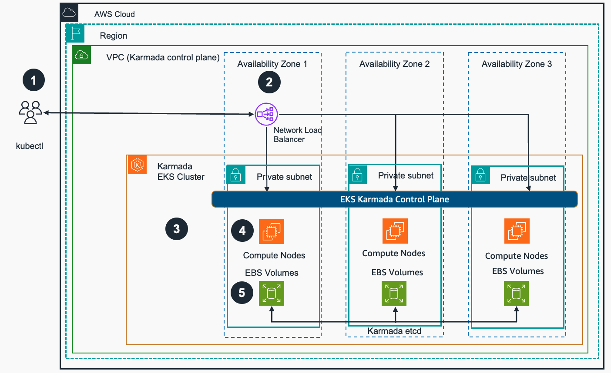
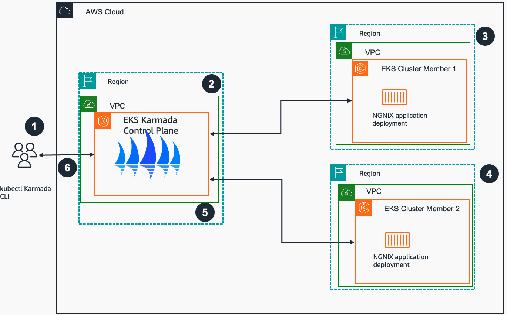

# Multi-cluster application management with Amazon EKS and Karmada on AWS

This guidance describes architectural considerations and configuration steps for deploying a federated Kubernetes environment in [Amazon Web Services (AWS)](https://aws.amazon.com) Cloud for [Amazon Elastic Kubernetes Service (Amazon EKS)](https://aws.amazon.com/eks) using CNCF Open Source Kubernetes Armada [(Karmada)](https://www.cncf.io/blog/2022/03/22/karmada-multi-cluster-management-with-an-ocean-of-nodes/) project. 

Karmada is a [Kubernetes](https://kubernetes.io/) cluster management system with advanced scheduling capabilities, which enables you to deploy and run your conatinerized applications across multiple Kubernetes clusters, with no changes to your applications structure. This guide focuses on deploying Karmada with highly available Amazon EKS clusters.

The intended audience of this guide are DevOps engineers, Cloud architects, system administrators, and platform engineers who would like to get hands-on experience architecting cloud-native applications in the AWS Cloud and are familiar with Kubernetes technology.

### Use cases

With Karmada, organizations can streamline application workload distribution, optimize resource utilization, and enhance resilience across diverse Kubernetes environments. Use cases for multi-cluster management with Karmada include:

- Hybrid Deployments
Karmada is instrumental in facilitating hybrid deployments, enabling organizations to seamlessly distribute applications across diverse environments, including on-premises data centers, AWS and other cloud providers. This enables organizations to leverage the benefits of both environments while ensuring consistent management and orchestration through Kubernetes. With Karmada, organizations can optimize resource utilization, enhance resilience, and maintain operational efficiency across their hybrid cloud infrastructure.

- Geographically Distributed Workloads
For customers with a global presence, Karmada facilitates the deployment of applications across geographically distributed Kubernetes clusters. This provides low-latency access for regional users while delivering fault tolerance through redundant deployments.

- Resource Optimization and Scaling
Karmada enables efficient resource utilization by dynamically scaling application instances across multiple clusters based on real-time demand. This helps organizations minimize infrastructure costs while ensuring optimal performance and responsiveness for their applications.

- Disaster Recovery and High Availability
Karmada supports disaster recovery strategies by replicating critical workloads across multiple clusters. In the event of a cluster failure or outage, Karmada automatically redirects traffic to healthy clusters. This minimizes downtime and maintains business continuity.

- Multi-Tenancy and Isolation
Karmada enables multi-tenancy through workload segregation, enhancing security and isolation. It also provides centralized management and visibility through a unified control plane.

- Blue-Green and Canary Deployments
With Karmada, organizations can implement advanced deployment strategies such as blue-green and canary deployments across multiple clusters. This facilitates risk-free testing of new features and versions before production rollout.

### Features and benefits

The Guidance for Multi-cluster application management with Amazon EKS and Karmada on AWS guidance provides the following features:

## Architecture overview

Below are architecture diagrams of a sample Karamada based Cluster architecture with parent and managed clusters and its centralized containerized application deployment process to those clusters. 

### Architecture diagrams and workflow steps

You can find below architecture diagrams of a sample Karmada based EKS Cluster architecture with parent and managed clusters and depction of centralized containerized application deployment process to those clusters. 

<!--  -->
  
 
Figure 1: Multi-cluster application management with Amazon EKS and Karmada on AWS - Karmada control plane and managed clusters provisioning

 
1. User interacts with the Karmada API server (part of Karmada Control Plane) using the `kubectl` utility with the Karmada plugin and a Network Load Balancer as the endpoint. 
2. A Network Load Balancer provides SSL termination and acts as a proxy for Karmada API server running on Amazon EKS parent cluster.
3. The Karmada Control Plane exposes the Karmada API via its API server in addition to the Kubernetes API, which receives calls for Kubernetes and Karmada management tasks. 
4. Karmada runs several components on the Amazon EKS compute nodes. To keep records of API objects and state, its API server uses its own etcd database. 
5. Karmada etcd database uses EBS volumes attached to compute nodes/EC2 instances to keep its state and consistency. All state changes and updates get persisted in EBS volumes across all EC2 compute nodes that host etcd pods. 
  

<!--  -->
 
 
Figure 2: Multi-cluster application management with Amazon EKS and Karmada on AWS - application deployment example

 
1. User interacts with the Karmada API server (part of Karmada Control Plane) using the kubectl CLI with the Karmada plugin. User sends a command for multiple clusters, ex. a multi-region deployment of [NGNIX](nginx.com) application with  equal weight across two member EKS clusters. 
2. The Karmada Control Plane maintains the status and state of all member EKS clusters. Upon receiving the user request it interprets the requirement and instructs member clusters accordingly (e.g. run an NGINX deployment in each member cluster). 
3. The EKS cluster member 1 receives instructions from Karmada Control Plane to deploy and run an NGINX container application deployment. 
4. The EKS cluster member 2 receives instructions from Karmada Control Plane to deploy and run an NGINX container application deployment. 
5. The EKS Karmada Control Plane cluster checks application deployment status on the member clusters and updates state in its etcd database. 
6. User validates the status of multi-cluster application deployment communicating with Karmada Control Plane via kubectl Karmada CLI. 
  
Following this architecture, you should be able to:

- Deploy applications on multiple Amazon EKS clusters that provide a highly available environment
- Create the infrastructure that caters for workloads compliant with local regulation about data residency

<!-- ### Architecture workflow steps --> 

### AWS services used in this Guidance

| **AWS service**  | Description |
|-----------|------------|
| [Amazon Elastic Kubernetes Service (EKS)](https://aws.amazon.com/eks/){:target="_blank"}|Core service - EKS service is used to host the Karmada solution that uses containers. In essence it is an extension of the Kubernetes API.|
| [Amazon Elastic Compute Cloud (EC2)](https://aws.amazon.com/ec2/){:target="_blank"}|Core service - EC2 service is used as the host of the containers needed for this solution.|
[Amazon Virtual Private Cloud - VPC](https://aws.amazon.com/vpc/){:target="_blank"}| Core Service - network security layer |
| [Amazon Elastic Conatiner Registry - ECR](http://aws.amazon.com/ecr/){:target="_blank"} | Supporting service -used for storing container images required by the runtimes. |
| [Amazon Network Load Balancer (NLB)](https://aws.amazon.com/elasticloadbalancing/network-load-balancer/){:target="_blank"}|Supporting service - The NLB acts as a proxy for Karmada services running on Amazon EKS parent cluster. The load balancer is the entry point to interact with the Karmada API server and forwards traffic to any healthy backend node to make sure that the solution will still be working in case of any single node or availability zone failure.|
| [Amazon Elastic Block Store (EBS)](https://aws.amazon.com/ebs){:target="_blank"}|Supporting service - EBS volumes are used by the Karmada etcd database attached to compute nodes/EC2 instances to keep its state and consistency. All state changes and updates get persisted in EBS volumes across all EC2 compute nodes that host etcd pods.|
| [AWS Identity and Access Management (IAM)](https://aws.amazon.com/iam/){:target="_blank"}|Supporting service - AWS IAM service is used for the creation of an IAM user with adequate permissions to create and delete Amazon EKS clusters access.|

## Security
When you build systems on AWS infrastructure, security responsibilities are shared between you and AWS. This [shared responsibility model](https://aws.amazon.com/compliance/shared-responsibility-model/) reduces your operational burden because AWS operates, manages, and controls the components including the host operating system, the virtualization layer, and the physical security of the facilities in which the services operate. For more information about AWS security visit [AWS Cloud Security](http://aws.amazon.com/security/).

For the purposes of this guidance, you have to leverage the use of [VPC security groups](https://docs.aws.amazon.com/managedservices/latest/userguide/about-security-groups.html) and [IAM users and roles](https://docs.aws.amazon.com/IAM/latest/UserGuide/id.html). Access to solution components is controlled through VPC security groups and IAM policies. A Security group allowing TCP port 32443 is automatically created for the NLB. This group is attached to all Karmada cluster nodes. An IAM user with permissions to create and delete EKS clusters (admin level access) is also required.

## Supported AWS Regions

The AWS services used for this guidance are supported in *all available AWS regions (TO VERIFY)*: 

## Quotas

Service quotas, also referred to as limits, are the maximum number of service resources or operations for your AWS account.

### Quotas for AWS services in this Guidance

Make sure you have sufficient quota for each of the services implemented in this solution. For more information, see [AWS service quotas](https://docs.aws.amazon.com/general/latest/gr/aws_service_limits.html).

To view the service quotas for all AWS services in the documentation without switching pages, view the information in the [Service endpoints and quotas](https://docs.aws.amazon.com/general/latest/gr/aws-general.pdf#aws-service-information) page in the PDF instead.

## Deployment 
Below are high level guidance deployment options available: 

1. **Instructions to deploy manually**:

    - Amazon EKS cluster to host Karmada control plane and act as a parent cluster for multi-cluster management.
    - Karmada in high availability mode with network load balancer.
    - Amazon EKS clusters to act as member clusters for Karmada.
    - Sample workload using Karmada multi-cluster deployment replicas.

2. **Shell script to deploy automatically**:

    - Amazon EKS cluster to host Karmada control plane and act as a parent cluster for multi-cluster management.
    - Karmada in high availability mode with network load balancer.
    - Amazon EKS clusters to act as member clusters for Karmada.
    - Sample workload using Karmada multi-cluster deployment replicas.

3. **CDK application to deploy automatically**:

    - Amazon VPC with 3 public and 3 private subnets with a NAT gateway.
    - Management host (EC2 instance) for Amazon EKS and Karmada.
    - Amazon EKS cluster to host Karmada control plane and act as a parent cluster for multi-cluster management.
    - Karmada in high availability mode with network load balancer.

Please refer to [IMPLEMENTATION GUIDE](https://implementationguides.kits.eventoutfitters.aws.dev/mcm-karmada-0116/compute/multi-cluster-management-with-amazon-eks-karmada.html) for detailed instructions for all deployment options above. 

## Security

See [CONTRIBUTING](CONTRIBUTING.md#security-issue-notifications) for more information.

## License

This library is licensed under the MIT-0 License. See the LICENSE file.
