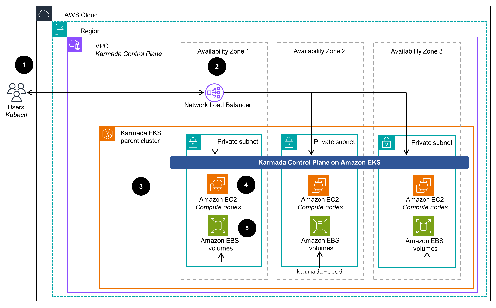
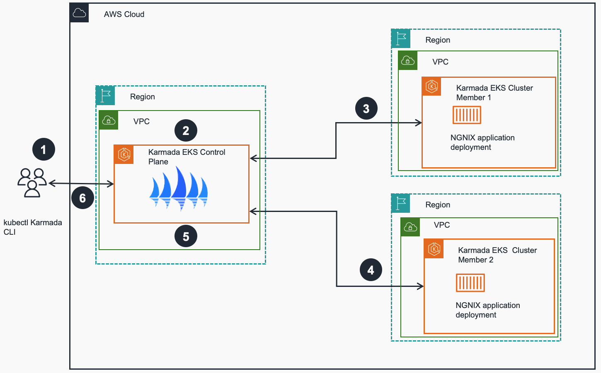

# Multi-cluster Application management with Amazon EKS and Karmada on AWS

This guidance describes architectural considerations and configuration steps for deploying a federated Kubernetes environment in [Amazon Web Services (AWS)](https://aws.amazon.com) Cloud for [Amazon Elastic Kubernetes Service (Amazon EKS)](https://aws.amazon.com/eks) using CNCF Open Source Kubernetes Armada [(Karmada)](https://www.cncf.io/blog/2022/03/22/karmada-multi-cluster-management-with-an-ocean-of-nodes/) project. 

Karmada is a [Kubernetes](https://kubernetes.io/) cluster management system with advanced scheduling capabilities, which enables you to deploy and run your containerized applications across multiple Kubernetes clusters, with no changes to your applications structure. This guidance focuses on deploying Karmada with highly available Amazon EKS clusters.

The intended audience of this guidance are DevOps engineers, Cloud architects, system administrators, and platform engineers who would like to get hands-on experience architecting cloud-native applications in the AWS Cloud and are familiar with Kubernetes technology.

### Use cases

With Karmada, organizations can streamline application workload distribution, optimize resource utilization, and enhance resilience across diverse Kubernetes environments. Use cases for multi-cluster management with Karmada include:

- Hybrid Deployments
Karmada is instrumental in facilitating hybrid deployments, enabling organizations to seamlessly distribute applications across diverse environments, including on-premises data centers, AWS and other cloud providers. This enables organizations to leverage the benefits of both environments while ensuring consistent management and orchestration through Kubernetes. With Karmada, organizations can optimize resource utilization, enhance resilience, and maintain operational efficiency across their hybrid cloud infrastructure.

- Geographically Distributed Workloads
For customers with a global presence, Karmada facilitates the deployment of applications across geographically distributed Kubernetes clusters. This provides low-latency access for regional users while delivering fault tolerance through redundant deployments.

- Resource Optimization and Scaling
Karmada enables efficient resource utilization by dynamically scaling application instances across multiple clusters based on real-time demand. This helps organizations minimize infrastructure costs while ensuring optimal performance and responsiveness for their applications.

- Disaster Recovery and High Availability
Karmada supports disaster recovery strategies by replicating critical workloads across multiple clusters. In the event of a cluster failure or outage, Karmada automatically redirects traffic to healthy clusters. This minimizes downtime and maintains business continuity.

- Multi-Tenancy and Isolation
Karmada enables multi-tenancy through workload segregation, enhancing security and isolation. It also provides centralized management and visibility through a unified control plane.

- Blue-Green and Canary Deployments
With Karmada, organizations can implement advanced deployment strategies such as blue-green and canary deployments across multiple clusters. This facilitates risk-free testing of new features and versions before production rollout.

### Features and benefits
The Guidance for Multi-cluster Application management with Amazon EKS and Karmada provides the following features:

## Architecture overview

Below are architecture diagrams of a sample Karmada based Cluster architecture with parent and managed clusters and its centralized containerized application deployment process to those clusters. 

### Architecture diagrams and workflow steps

You can find below architecture diagrams of a sample Karmada based EKS Cluster architecture with parent and managed clusters and depiction of centralized containerized application deployment process to those clusters. 

  
 
<i>Figure 1: Multi-cluster application management with Amazon EKS and Karmada - Control plane and managed clusters </i>

 
1. User interacts with the Karmada API server (part of Karmada Control Plane) using the `kubectl` utility with the Karmada plugin and a Network Load Balancer as the endpoint. 
2. A Network Load Balancer provides SSL termination and acts as a proxy for Karmada API server running on Amazon EKS parent cluster.
3. The Karmada Control Plane exposes the Karmada API via its API server in addition to the Kubernetes API, which receives calls for Kubernetes and Karmada management tasks. 
4. Karmada runs several components on the Amazon EKS compute nodes. To keep records of API objects and state, its API server uses its own etcd database. 
5. Karmada etcd database uses EBS volumes attached to compute nodes/EC2 instances to keep its state and consistency. All state changes and updates get persisted in EBS volumes across all EC2 compute nodes that host etcd pods. 
  

 
 
<i>Figure 2: Multi-cluster application management with Amazon EKS and Karmada - Application deployment to managed clusters </i>

 
1. User interacts with the Karmada API server (part of Karmada Control Plane) using the `kubectl` CLI with the Karmada plugin. User sends a command for multiple clusters, ex. a multi-region deployment of [NGNIX](nginx.com) application with  equal weight across two member EKS clusters. 
2. The Karmada Control Plane maintains the status and state of all member EKS clusters. Upon receiving the user request it interprets the requirement and instructs member clusters accordingly (e.g. run an NGINX deployment in each member cluster). 
3. The EKS cluster member 1 receives instructions from Karmada Control Plane to deploy and run an NGINX container application deployment. 
4. The EKS cluster member 2 receives instructions from Karmada Control Plane to deploy and run an NGINX container application deployment. 
5. The EKS Karmada Control Plane cluster checks application deployment status on the member clusters and updates state in its etcd database. 
6. User validates the status of multi-cluster application deployment communicating with Karmada Control Plane via `kubectl` Karmada CLI. 
  
Following this architecture, you should be able to:

- Deploy containerized applications on multiple Amazon EKS clusters that provide a highly available environment
- Create an infrastructure that caters to workloads compliant with local regulation about data residency

<!-- ### Architecture workflow steps --> 

### AWS services used in this Guidance

| **AWS service**  | Role | Description |
|-----------|------------|-------------|
| [Amazon Elastic Kubernetes Service (EKS)](https://aws.amazon.com/eks/)| Core service |  EKS service is used to host the Karmada solution that uses containers. In essence it is an extension of the Kubernetes API.|
| [Amazon Elastic Compute Cloud (EC2)](https://aws.amazon.com/ec2/)| Core service | EC2 service is used as the host of the containers needed for this solution.|
[Amazon Virtual Private Cloud - VPC](https://aws.amazon.com/vpc/)| Core Service | Network security layer |
| [Amazon Elastic Conatiner Registry - ECR](http://aws.amazon.com/ecr/) | Supporting service | Used for storing container images required by the runtimes. |
| [Amazon Network Load Balancer (NLB)](https://aws.amazon.com/elasticloadbalancing/network-load-balancer/)|Supporting service | The NLB acts as a proxy for Karmada services running on Amazon EKS parent cluster. The load balancer is the entry point to interact with the Karmada API server and forwards traffic to any healthy backend node to make sure that the solution will still be working in case of any single node or availability zone failure.|
| [Amazon Elastic Block Store (EBS)](https://aws.amazon.com/ebs)|Supporting service | Encrypted EBS volumes are used by the Karmada etcd database attached to compute nodes/EC2 instances to keep its state and consistency. All state changes and updates get persisted in EBS volumes across all EC2 compute nodes that host etcd pods.|
| [AWS Identity and Access Management (IAM)](https://aws.amazon.com/iam/)|Supporting service |  AWS IAM service is used for the creation of an IAM user with adequate permissions to create and delete Amazon EKS clusters access.|

## Plan your deployment

This guidance is based on Amazon EKS as Kubernetes cluster to host Karmada and manage other Amazon EKS clusters. However, as Karmada is an extension to the native [Kubernetes API](https://kubernetes.io/docs/concepts/overview/kubernetes-api/), you can extend this solution and expand the multi-cluster management to any Kubernetes cluster, no matter of the deployment method, tool or location.

### Cost 

You are responsible for the cost of the AWS services used while running this solution guidance. As of February 2024, the cost for running this guidance with the default settings in the US-East(N. Virginia) `us-east-1` Region is $0.10 per hour for each Amazon EKS cluster you have created. On top of this you have to take into account the costs incurred by the AWS resources used for the EKS cluster (e.g. Amazon Elastic Compute Cloud (EC2) Instances, Amazon Elastic Block Store (EBS) volumes etc).

We recommend creating a [budget](https://docs.aws.amazon.com/cost-management/latest/userguide/budgets-create.html) through [AWS Cost Explorer](http://aws.amazon.com/aws-cost-management/aws-cost-explorer/) to help manage costs. Prices are subject to change. For full details, refer to the pricing webpage for each AWS service used in this Guidance.

### Estimated monthly cost breakdown

The following table provides a sample cost breakdown for deploying this guidance with 3 Amazon EKS clusters (one Karmada control plane and 2 managed clusters) in the US-East-1 `us-east-1` region for one month. The AWS cost calculator is available [here](https://calculator.aws/#/estimate?id=03fdada5a7299a7b70c51a6c9b0037cd0117cbfc). Please that cost calculations are based on the default configuration options of the [End-to-end, fully automated](#end-to-end-fully-automated) guidance deployment method described below.

| **AWS service**  | Dimensions | Cost, month \[USD\] |
|-----------|------------|------------|
| Amazon EKS  | 1 cluster | \$ 219 |
| Amazon EC2  | 3 EC2 compute cluster nodes in each of the 3 clusters | \$ 328.50 |
| Amazon EBS  | 5GB worth of EBS disk gp3 type | \$ 1.25 |
| Amazon ELB  | 1 Network Load Balancer | \$ 20.81 *|
| NAT Gateway | 1 instance | \$ 112.05 | 
| Public IP address | 9 IPs | \$ 32.85 |
| **TOTAL estimate** |  | **\$ 714.41** |

NOTE:
* An NLCU measures the dimensions on which the Network Load Balancer processes your traffic (averaged over an hour). The three dimensions measured are:    - New connections or flows: Number of newly established connections/flows per second. Many technologies (HTTP, WebSockets, etc.) reuse Transmission Control Protocol (TCP) connections for efficiency. The number of new connections is typically lower than your request or message count.    - Active connections or flows: Peak concurrent connections/flows, sampled minutely.    - Processed bytes: The number of bytes processed by the load balancer in GBs.    You are charged only on one of those dimensions that has the highest usage for the hour.

## Security

When you build systems on AWS infrastructure, security responsibilities are shared between you and AWS. This [shared responsibility model](https://aws.amazon.com/compliance/shared-responsibility-model/) reduces your operational burden because AWS operates, manages, and controls the components including the host operating system, the virtualization layer, and the physical security of the facilities in which the services operate. For more information about AWS security visit [AWS Cloud Security](http://aws.amazon.com/security/).

This guidance relies on a lot of reasonable default options and "principle of least privilege" access for all resources. Users that deploy it in production should go through all the deployed resources and ensure those defaults comply with their security requirements and policies, have adequate logging levels and alarms enabled and protect access to publicly exposed APIs. Since the Kubernetes clusters should be able to communicate with each other and can be deployed on different VPCs, AWS regions, AWS accounts or even in non-AWS infrastructure, this solution assumes publicly exposed Kubernetes APIs that utilize inherent Kubernetes mechanisms to protect access. 

Using this solution you also expose publicly the Karmada API service on port `tcp/32443` that utilizes inherent certificate based access control to protect unauthorized access. In case those certificates are exposed and a malicious user gets access to the Karmada API service, they then will be able to create or manipulate any workloads managed by Karmada, such as multi-cluster deployments. To minimize the attack surface and enhance protection to your publicly exposed Kubernetes and Karmada APIs you should adjust accordingly the security groups attached to the Amazon EKS clusters and the Karmada load balancer and allow communication only from designated and authorized IP addresses or networks. 

All resources deployed by this solution rely on inherent AWS security controls, including but not limited to VPC security groups, IAM users and roles and security certificates. By default, this solutions exposes only the necessary endpoints such as the Kubernetes API and the Karmada API protected with end-to-end encryption. 

**NOTE**: Please note that by cloning and using 3rd party open-source code you assume responsibility for its patching/securing/managing in the context of this project.

## Supported AWS Regions

The AWS services used for this guidance are supported in *all available AWS regions*: 

## Quotas

Service quotas, also referred to as limits, are the maximum number of service resources or operations for your AWS account.

### Quotas for AWS services in this Guidance

Make sure you have sufficient quota for each of the services implemented in this solution. For more information, see [AWS service quotas](https://docs.aws.amazon.com/general/latest/gr/aws_service_limits.html).

To view the service quotas for all AWS services in the documentation without switching pages, view the information in the [Service endpoints and quotas](https://docs.aws.amazon.com/general/latest/gr/aws-general.pdf#aws-service-information) page in the PDF instead.

## Deployment 
Below are high level guidance deployment options available: 

1. **Instructions to deploy manually**:

    - Amazon EKS cluster to host Karmada control plane and act as a parent cluster for multi-cluster management.
    - Karmada in high availability mode with network load balancer.
    - Amazon EKS clusters to act as member clusters for Karmada.
    - Sample workload using Karmada multi-cluster deployment replicas.

2. **Shell script to deploy automatically**:

    - Amazon EKS cluster to host Karmada control plane and act as a parent cluster for multi-cluster management.
    - Karmada in high availability mode with network load balancer.
    - Amazon EKS clusters to act as member clusters for Karmada.
    - Sample workload using Karmada multi-cluster deployment replicas.

3. **CDK application to deploy automatically**:

    - Amazon VPC with 3 public and 3 private subnets with a NAT gateway.
    - Management host (EC2 instance) for Amazon EKS and Karmada.
    - Amazon EKS cluster to host Karmada control plane and act as a parent cluster for multi-cluster management.
    - Karmada in high availability mode with network load balancer.

Please refer to [FULL IMPLEMENTATION GUIDE](https://aws-solutions-library-samples.github.io/compute/multi-cluster-application-management-with-karmada-and-amazon-eks.html) for detailed instructions for all deployment options. 

## Security

See [CONTRIBUTING](CONTRIBUTING.md#security-issue-notifications) for more information.

## License

This library is licensed under the MIT-0 License. See the [LICENSE](LICENSE) file.
